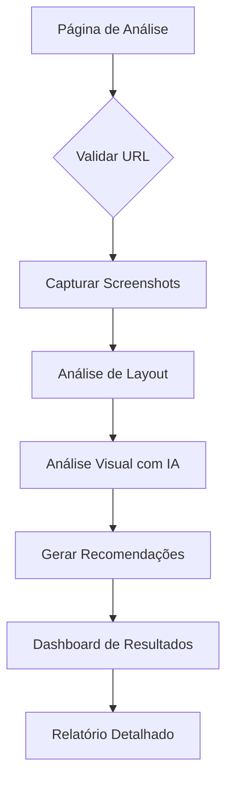

## 1. Product Overview
Sistema de testes responsivos com análise inteligente que permite aos usuários testar a responsividade de websites em múltiplos tamanhos de tela com feedback baseado em IA. O produto ajuda desenvolvedores e designers a identificar e corrigir problemas de responsividade, acessibilidade e UX de forma automatizada.

## 2. Core Features

### 2.1 User Roles
| Role | Registration Method | Core Permissions |
|------|---------------------|------------------|
| Free User | Email registration | 5 análises por mês, visualização básica de relatórios |
| Premium User | Upgrade via subscription | Análises ilimitadas, relatórios detalhados, histórico completo |

### 2.2 Feature Module
O sistema de testes responsivos consiste nas seguintes páginas principais:
1. **Página de Análise**: Campo de entrada de URL, status em tempo real, botão de análise.
2. **Dashboard de Resultados**: Galeria de capturas de tela, diagnóstico por IA, visualização de problemas.
3. **Relatório Detalhado**: Recomendações com código, referências de documentação, exemplos de soluções.

### 2.3 Page Details
| Page Name | Module Name | Feature description |
|-----------|-------------|---------------------|
| Página de Análise | URL Input Form | Validar e aceitar URLs web e localhost, exibir loading state durante análise. |
| Página de Análise | Status Display | Mostrar progresso da análise em tempo real com animações. |
| Dashboard de Resultados | Screenshot Gallery | Exibir capturas em grid responsivo para mobile, tablet, desktop e 4K. |
| Dashboard de Resultados | AI Diagnosis | Listar problemas detectados com ícones de severidade (crítico/alerta/info). |
| Dashboard de Resultados | Issue Details | Expandir problemas para ver descrição completa e localização. |
| Relatório Detalhado | Code Recommendations | Fornecer snippets de código CSS/Tailwind para corrigir problemas. |
| Relatório Detalhado | Documentation Links | Incluir links para MDN, Tailwind, React docs relevantes. |
| Relatório Detalhado | Before/After Examples | Mostrar visualizações comparativas de problemas e soluções. |

## 3. Core Process
O usuário insere uma URL no formulário, o sistema captura screenshots em 4 resoluções diferentes, analisa os problemas de responsividade usando IA e ferramentas especializadas, gera recomendações com código e entrega um relatório completo.

## 4. User Interface Design

### 4.1 Design Style
- Cores primárias: Azul tecnológico (#3B82F6) e cinza escuro (#1F2937)
- Cores secundárias: Verde sucesso (#10B981) e vermelho erro (#EF4444)
- Botões: Estilo arredondado com hover states suaves
- Fonte: Inter para headings, Roboto para body text
- Layout: Card-based com sombras sutis e espaçamento generoso
- Ícones: Heroicons outline para consistência

### 4.2 Page Design Overview
| Page Name | Module Name | UI Elements |
|-----------|-------------|-------------|
| Página de Análise | URL Input Form | Input grande com ícone de link, botão primário azul, validação visual em tempo real. |
| Página de Análise | Loading State | Animação de pulsação com gradiente, texto explicativo do progresso. |
| Dashboard de Resultados | Screenshot Gallery | Grid responsivo 2x2, imagens com bordas arredondadas e zoom on hover. |
| Dashboard de Resultados | AI Diagnosis | Cards expansíveis com badge de severidade, ícones de categoria. |
| Relatório Detalhado | Code Recommendations | Blocos de código syntax-highlighted, botão copiar código. |

### 4.3 Responsiveness
Desktop-first approach com breakpoints em 640px, 768px, 1024px e 1280px. O sistema deve ser testado com sua própria ferramenta para garantir responsividade completa.

### 4.4 3D Scene Guidance
Não aplicável - este é um sistema de análise 2D para websites.