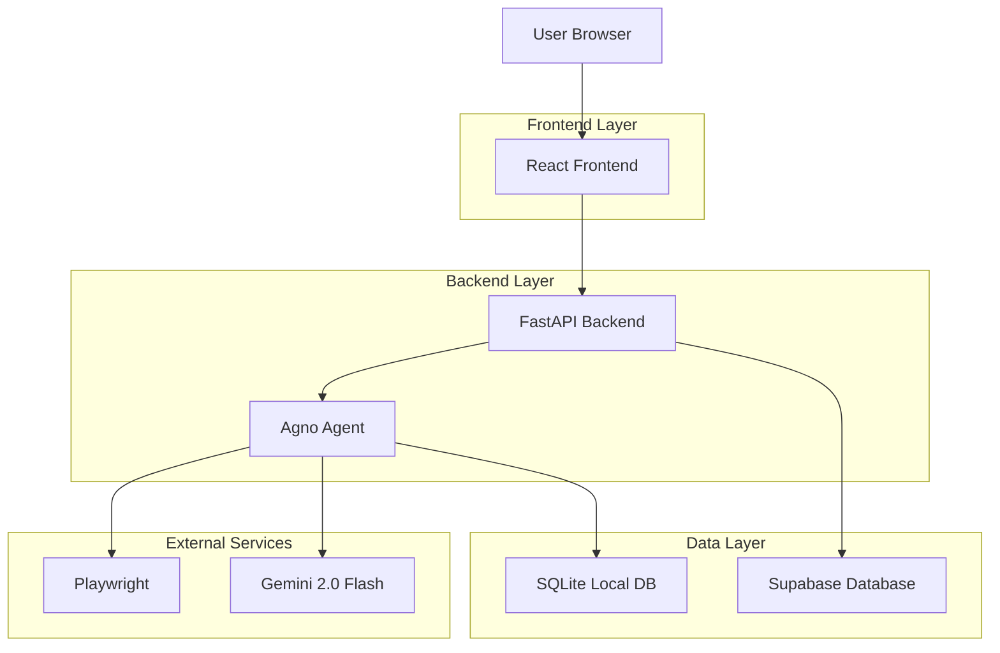
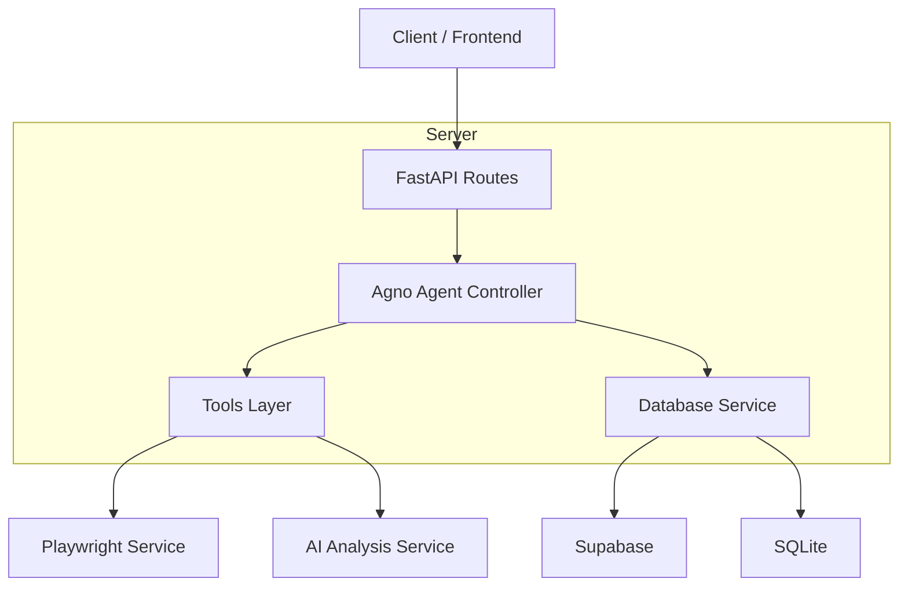
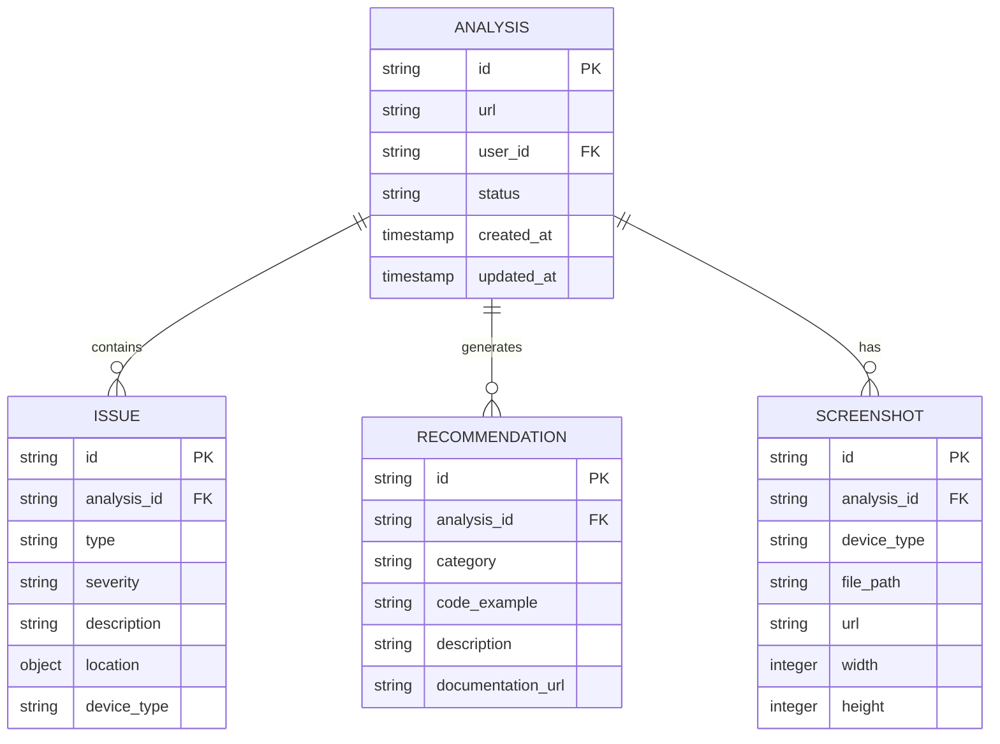

## 1. Architecture design



## 2. Technology Description
- Frontend: React@18 + tailwindcss@3 + vite
- Initialization Tool: vite-init
- Backend: FastAPI + Agno Framework
- Database: Supabase (PostgreSQL) + SQLite local
- AI Model: Gemini 2.0 Flash (Free)
- Screenshot Tool: Playwright

## 3. Route definitions
| Route | Purpose |
|-------|---------|
| / | Página de análise principal com formulário de URL |
| /results/:id | Dashboard de resultados com screenshots e diagnóstico |
| /report/:id | Relatório detalhado com recomendações e código |
| /history | Histórico de análises anteriores do usuário |

## 4. API definitions

### 4.1 Core API

Análise de URL
```
POST /api/analyze
```

Request:
| Param Name| Param Type  | isRequired  | Description |
|-----------|-------------|-------------|-------------|
| url  | string      | true        | URL do site a ser analisado |
| user_id  | string      | false       | ID do usuário (opcional) |

Response:
| Param Name| Param Type  | Description |
|-----------|-------------|-------------|
| analysis_id    | string     | ID único da análise |
| status    | string     | Status inicial: "processing" |
| screenshots    | array     | URLs das capturas de tela |

Example
```json
{
  "url": "https://example.com",
  "user_id": "user_123"
}
```

Obter resultados da análise
```
GET /api/analysis/{id}
```

Response:
| Param Name| Param Type  | Description |
|-----------|-------------|-------------|
| id    | string     | ID da análise |
| url    | string     | URL analisada |
| status    | string     | Status: completed/processing/failed |
| issues    | array     | Lista de problemas detectados |
| recommendations    | array     | Sugestões de correção |
| screenshots    | object     | URLs das capturas por dispositivo |
| created_at    | string     | Timestamp da análise |

## 5. Server architecture diagram



## 6. Data model

### 6.1 Data model definition


### 6.2 Data Definition Language

Análises Table (analyses)
```sql
-- create table
CREATE TABLE analyses (
    id UUID PRIMARY KEY DEFAULT gen_random_uuid(),
    url VARCHAR(500) NOT NULL,
    user_id UUID REFERENCES auth.users(id),
    status VARCHAR(20) DEFAULT 'processing' CHECK (status IN ('processing', 'completed', 'failed')),
    created_at TIMESTAMP WITH TIME ZONE DEFAULT NOW(),
    updated_at TIMESTAMP WITH TIME ZONE DEFAULT NOW()
);

-- create index
CREATE INDEX idx_analyses_user_id ON analyses(user_id);
CREATE INDEX idx_analyses_created_at ON analyses(created_at DESC);
CREATE INDEX idx_analyses_status ON analyses(status);

-- grant permissions
GRANT SELECT ON analyses TO anon;
GRANT ALL PRIVILEGES ON analyses TO authenticated;
```

Issues Table (issues)
```sql
-- create table
CREATE TABLE issues (
    id UUID PRIMARY KEY DEFAULT gen_random_uuid(),
    analysis_id UUID REFERENCES analyses(id) ON DELETE CASCADE,
    type VARCHAR(50) NOT NULL,
    severity VARCHAR(20) CHECK (severity IN ('critical', 'warning', 'info')),
    description TEXT NOT NULL,
    location JSONB,
    device_type VARCHAR(20),
    created_at TIMESTAMP WITH TIME ZONE DEFAULT NOW()
);

-- create index
CREATE INDEX idx_issues_analysis_id ON issues(analysis_id);
CREATE INDEX idx_issues_severity ON issues(severity);

-- grant permissions
GRANT SELECT ON issues TO anon;
GRANT ALL PRIVILEGES ON issues TO authenticated;
```

Recommendations Table (recommendations)
```sql
-- create table
CREATE TABLE recommendations (
    id UUID PRIMARY KEY DEFAULT gen_random_uuid(),
    analysis_id UUID REFERENCES analyses(id) ON DELETE CASCADE,
    category VARCHAR(50) NOT NULL,
    code_example TEXT,
    description TEXT NOT NULL,
    documentation_url VARCHAR(500),
    created_at TIMESTAMP WITH TIME ZONE DEFAULT NOW()
);

-- create index
CREATE INDEX idx_recommendations_analysis_id ON recommendations(analysis_id);
CREATE INDEX idx_recommendations_category ON recommendations(category);

-- grant permissions
GRANT SELECT ON recommendations TO anon;
GRANT ALL PRIVILEGES ON recommendations TO authenticated;